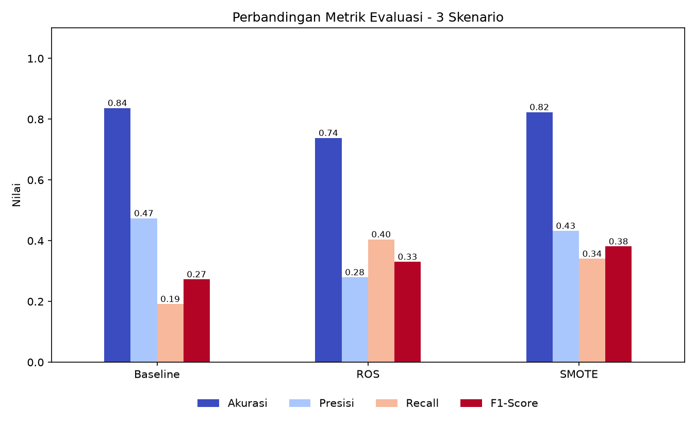

# Klasifikasi Attrition Karyawan: Decision Tree, Z-Score, ROS, dan SMOTE

Program ini memprediksi apakah seorang karyawan akan berhenti bekerja (_Attrition_) pada dataset **IBM HR Analytics Employee Attrition & Performance**. Data bersifat tidak seimbang (83,9% _No_ dan 16,1% _Yes_), sehingga dibandingkan tiga skenario: tanpa resampling (_baseline_), **Random Oversampling (ROS)**, dan **SMOTE**.

## Alur Program

1. **Input**: membaca dataset (1470 baris, 35 kolom) dan memeriksa distribusi kelas.
2. **Preprocessing**: deteksi missing value, duplikasi, dan outlier (IQR); hapus kolom konstan/ID (`EmployeeCount`, `Over18`, `StandardHours`, `EmployeeNumber`); encoding target (`Yes` = 1, `No` = 0).
3. **Split data**: 80% training dan 20% testing (stratified, `random_state=42`).
4. **Handling outlier**: capping IQR pada 7 kolom, batas dihitung dari data training saja.
5. **Transformation**: Z-Score (`StandardScaler`) untuk 23 fitur numerik dan one-hot encoding untuk 7 fitur kategorikal, di-_fit_ hanya pada data training.
6. **Resampling (hanya data training)**: ROS dan SMOTE (`k_neighbors=5`).
7. **Training**: Decision Tree (`criterion="gini"`, `max_depth=5`, `random_state=42`) untuk tiga skenario.
8. **Testing dan Evaluasi**: confusion matrix, akurasi, presisi, recall, dan F1-Score (kelas positif = `Yes`).

## Struktur Folder

```
.
├── README.md
├── .gitignore
├── Dataset/
│   └── IBM_HR_Attrition.xlsx
├── File Python/
│   └── uts.py
├── 01_distribusi_attrition.png
├── 02_boxplot_deteksi_outlier.png
├── 03_boxplot_handling_outlier.png
├── 04_confusion_matrix_baseline.png
├── 04_confusion_matrix_ros.png
├── 04_confusion_matrix_smote.png
├── 05_perbandingan_metrik.png
├── 06_distribusi_kelas_training.png
└── hasil_perbandingan_model.csv
```

## Cara Menjalankan

```bash
# 1. (opsional) buat virtual environment
python -m venv .venv
source .venv/bin/activate        # Windows: .venv\Scripts\activate

# 2. pasang library
pip install pandas numpy matplotlib seaborn scikit-learn imbalanced-learn openpyxl

# 3. jalankan program
python "File Python/ml.py"
```

Grafik dan `hasil_perbandingan_model.csv` akan tersimpan di folder utama repository.

Program diuji dengan Python 3.12, pandas 3.0, numpy 2.4, scikit-learn 1.8, dan imbalanced-learn 0.14.

## Hasil (Data Testing: 294 sampel, 47 di antaranya kelas Yes)

| Skenario | Akurasi | Presisi | Recall | F1-Score | TN  | FP  | FN  | TP  |
| -------- | ------- | ------- | ------ | -------- | --- | --- | --- | --- |
| Baseline | 0,8367  | 0,4737  | 0,1915 | 0,2727   | 237 | 10  | 38  | 9   |
| ROS      | 0,7381  | 0,2794  | 0,4043 | 0,3304   | 198 | 49  | 28  | 19  |
| SMOTE    | 0,8231  | 0,4324  | 0,3404 | 0,3810   | 226 | 21  | 31  | 16  |

Presisi, recall, dan F1-Score dihitung untuk kelas `Yes`.



## Ringkasan Temuan

- Akurasi tinggi pada _baseline_ menyesatkan: hanya 9 dari 47 karyawan yang berhenti terdeteksi. Model yang selalu menebak `No` akan memperoleh akurasi 0,8401.
- **ROS** menghasilkan recall tertinggi (0,4043) tetapi dengan presisi terendah (0,2794).
- **SMOTE** memberi keseimbangan terbaik berdasarkan F1-Score (0,3810).
- Ketiga model menunjukkan tanda _overfitting_ (kinerja data training jauh di atas data testing), dan evaluasi hanya memakai satu kali pembagian data dengan 47 sampel kelas `Yes`, sehingga selisih ROS dan SMOTE perlu dibaca dengan hati-hati.

## Catatan

- Resampling hanya dilakukan pada data training; data testing tidak diubah.
- SMOTE standar pada kolom hasil one-hot dapat menghasilkan nilai pecahan pada kolom dummy. `SMOTENC` dapat dicoba sebagai alternatif.
- Dataset bersumber dari Kaggle: <https://www.kaggle.com/datasets/pavansubhasht/ibm-hr-analytics-attrition-dataset>.
